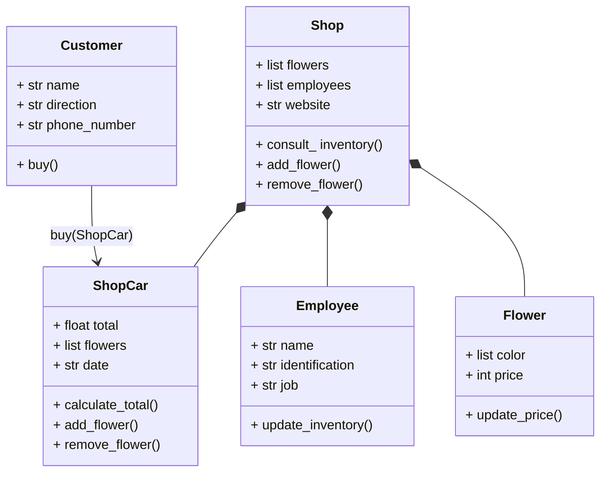

# Reto 2
Hola, soy }**Alejandro Bello** y pertenezco al grupo fenomenoides, a continuación nuestro logo:

Preparense para ver el grandioso logo: 

<figure>  
<figcaption><b> "somos programadores, no diseñadores" </b></figcaption></figure>

 

Para este reto, decidí plantar las relaciones que pueden haber a nivel general en una tienda online de flores, allí esta toda la interacción del cliente con la tienda y también, hay empleados que deben mantener en orden el inventario de la tienda. A continuación se muestra el diagrama de clases con sus relaciones:

